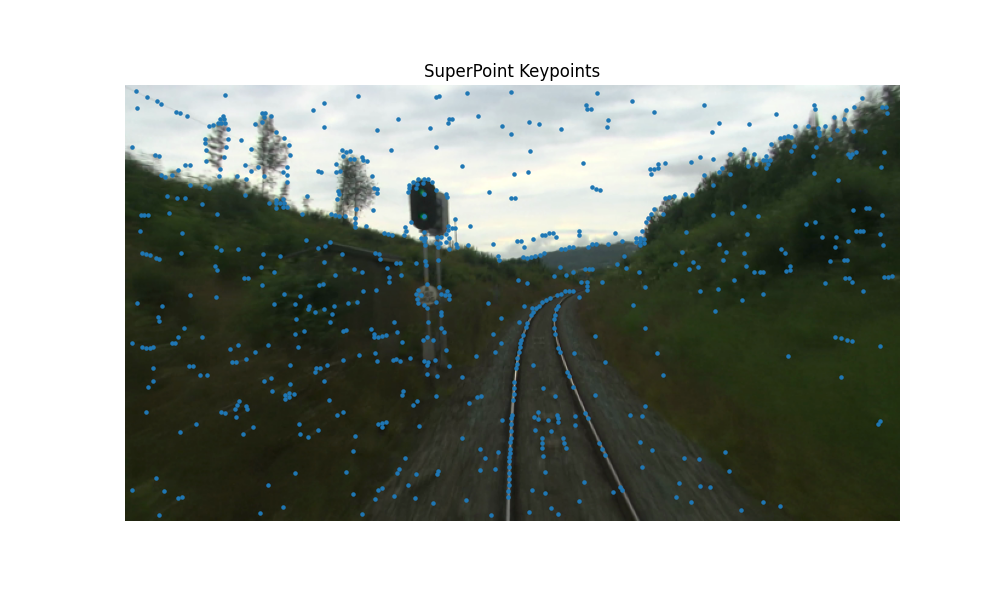
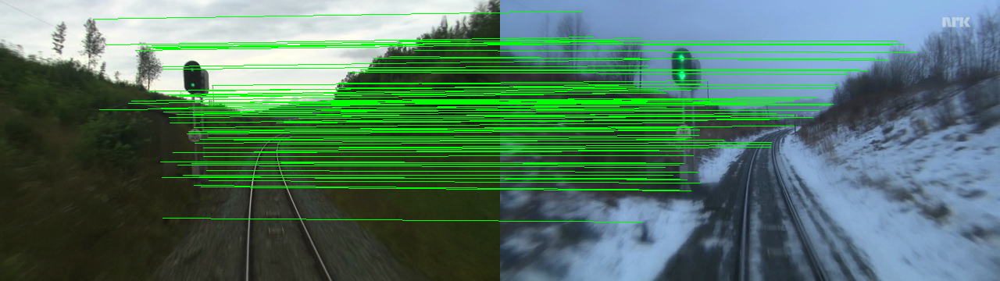
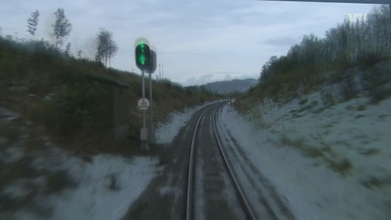

# Cross-Season Visual Localization and Image Alignment

## Overview

This project implements a deep learning-based visual localization pipeline for robust image matching and alignment across seasonal appearance changes. The objective is to establish reliable correspondences between images captured under significantly different environmental conditions (e.g., Summer vs Winter) and estimate a geometric transformation for image registration.

The proposed pipeline uses:

* **SuperPoint** for local feature extraction
* **LightGlue** for feature matching
* **RANSAC-based Homography Estimation** for geometric verification
* **Perspective Warping** for image alignment

The solution was developed and evaluated using the **Nordland Dataset** and follows the assignment requirements for cross-season visual localization.

---

# Problem Statement

Cross-season visual localization is a challenging computer vision problem due to:

* Seasonal appearance changes
* Snow-covered landscapes
* Illumination variations
* Vegetation changes
* Texture inconsistencies

Traditional handcrafted features often fail under such conditions.

The goal is to:

1. Detect robust visual features.
2. Match features across seasons.
3. Remove outliers.
4. Estimate a geometric transformation.
5. Align images accurately.

---

# Dataset

## Development Dataset

Nordland Dataset

The Nordland dataset provides synchronized image sequences captured from identical viewpoints during different seasons.

Directory structure:

```text
data/
├── summer/
│   ├── images-00900.png
│   ├── images-00901.png
│   └── ...
│
└── winter/
    ├── images-00900.png
    ├── images-00901.png
    └── ...
```

A subset of 51 aligned Summer-Winter image pairs was used for development and evaluation.

---

# Methodology

## 1. Feature Extraction

SuperPoint is used to extract:

* Keypoints
* Confidence scores
* Local descriptors

Advantages:

* Learned visual features
* Robust to illumination changes
* Robust to seasonal appearance changes

Configuration:

```python
max_num_keypoints = 1024
```

---
## 2. Feature Matching

LightGlue performs feature matching between descriptor sets extracted from the Summer and Winter images.

Advantages:

* Attention-based matching
* Robust correspondence estimation
* Efficient matching pipeline

Output:


---

## 3. Geometric Verification

Feature correspondences are filtered using:

```python
cv2.findHomography(..., cv2.RANSAC)
```

RANSAC removes:

* Incorrect matches
* Geometric outliers

Output:

```text
Inlier correspondences
Homography matrix
```

---

## 4. Homography Estimation

A perspective transformation matrix is estimated:

```text
H ∈ R^(3×3)
```

The homography is then used to align Summer images with Winter images.

---

## 5. Image Warping

The estimated homography is applied using:

```python
cv2.warpPerspective()
```

to generate aligned images.

Outputs:

* Warped image
* Overlay visualization

---

# Project Structure

```text
cross_season_matching/

├── data/
│   ├── summer/
│   └── winter/
│
├── outputs/
│   ├── matches/
│   ├── warped/
│   └── profiling/
│
├── src/
│   ├── matcher.py
│   ├── homography.py
│   ├── visualization.py
│   └── orb_baseline.py
│
├── main.py
├── evaluate_dataset.py
├── compare_methods.py
├── profiling.py
├── alignment_error_gt.py
├── report.pdf
├── requirements.txt
└── README.md
```

---

# Installation

## Create Virtual Environment

```bash
python -m venv .venv
```

Activate environment:

### Windows

```bash
.venv\Scripts\activate
```

### Linux / Mac

```bash
source .venv/bin/activate
```

---

## Install Dependencies

```bash
pip install torch torchvision
pip install lightglue
pip install opencv-python
pip install numpy
pip install matplotlib
pip install pandas
```

---

# Running the Pipeline

## Single Image Pair

```bash
python main.py
```

Outputs:

* Match visualization
* Homography matrix
* Overlay image

---

## Dataset Evaluation

```bash
python evaluate_dataset.py
```

Outputs:

```text
outputs/profiling/results.csv
```

Metrics:

* Total matches
* Inliers
* Inlier ratio
* Runtime

---

## Baseline Comparison

```bash
python compare_methods.py
```

Compares:

* ORB + BFMatcher
* SuperPoint + LightGlue

---

## Runtime Profiling

```bash
python profiling.py
```

Outputs:

* Data loading time
* Feature extraction and matching time
* Matrix estimation time
* Total latency

---

## Alignment Accuracy Evaluation

```bash
python alignment_error_gt.py
```

Outputs:

* Mean reprojection error
* Median reprojection error
* Maximum reprojection error

---

# Experimental Results

## Matching Performance

| Metric               | Value  |
| -------------------- | ------ |
| Average Matches      | 177.76 |
| Average Inliers      | 126.08 |
| Average Inlier Ratio | 70.22% |
| Best Inlier Ratio    | 94.71% |
| Worst Inlier Ratio   | 45.53% |

---

## Runtime Performance

| Metric          | Value  |
| --------------- | ------ |
| Average Latency | 4.54 s |
| Fastest Pair    | 3.93 s |
| Slowest Pair    | 5.03 s |

---

## Runtime Breakdown

| Component                     | Time       |
| ----------------------------- | ---------- |
| Data Loading                  | 12.37 ms   |
| Feature Extraction + Matching | 5148.35 ms |
| Matrix Estimation             | 3.90 ms    |
| Total                         | 5164.62 ms |

Observation:

Feature extraction and matching account for more than 99% of the total runtime.

---

## Alignment Accuracy

| Metric                     | Value    |
| -------------------------- | -------- |
| Mean Reprojection Error    | 2.588 px |
| Median Reprojection Error  | 2.832 px |
| Maximum Reprojection Error | 4.968 px |

The alignment error remains below the 5-pixel target specified in the assessment requirements.

---

# Baseline Comparison

## ORB + BFMatcher vs SuperPoint + LightGlue

| Method                 | Average Inlier Ratio | Success Rate |
| ---------------------- | -------------------- | ------------ |
| ORB + BFMatcher        | 59.97%*              | 70.6%        |
| SuperPoint + LightGlue | 70.22%               | 100%         |

*Computed only on successful ORB pairs.

### Observation

The deep-learning-based pipeline demonstrates:

* Higher robustness
* Better seasonal invariance
* Higher success rate
* More reliable geometric estimation

compared to the classical ORB baseline.

---

# Optimization Study

An optimization experiment was conducted by reducing the maximum number of extracted SuperPoint keypoints.

| Configuration  | Inlier Ratio | Latency |
| -------------- | ------------ | ------- |
| 2048 Keypoints | 69.77%       | 5.15 s  |
| 1024 Keypoints | 70.22%       | 4.54 s  |

Result:

* 11.8% latency reduction
* No loss in matching performance

The optimized configuration (1024 keypoints) was selected for the final system.

---

# Sample Outputs

Generated outputs include:

## Match Visualizations

```text
outputs/matches/
```

Contains:

* match_00900.png
* match_00910.png
* match_00920.png
* match_00930.png
* match_00940.png

---

## Warped Alignments

```text
outputs/warped/
```

Contains:

* overlay_00900.png
* overlay_00910.png
* overlay_00920.png
* overlay_00930.png
* overlay_00940.png

---

# Future Improvements

Potential improvements include:

* ONNX Runtime deployment
* FP16 inference
* TensorRT acceleration
* Multi-scale feature extraction
* GPU-based inference
* Real-time localization pipeline
* Visual place recognition integration

---

# Author

**Chetan Singh Kaurav**

B.Tech Computer Science and Engineering

ITM Gwalior

Computer Vision | Machine Learning | Deep Learning
